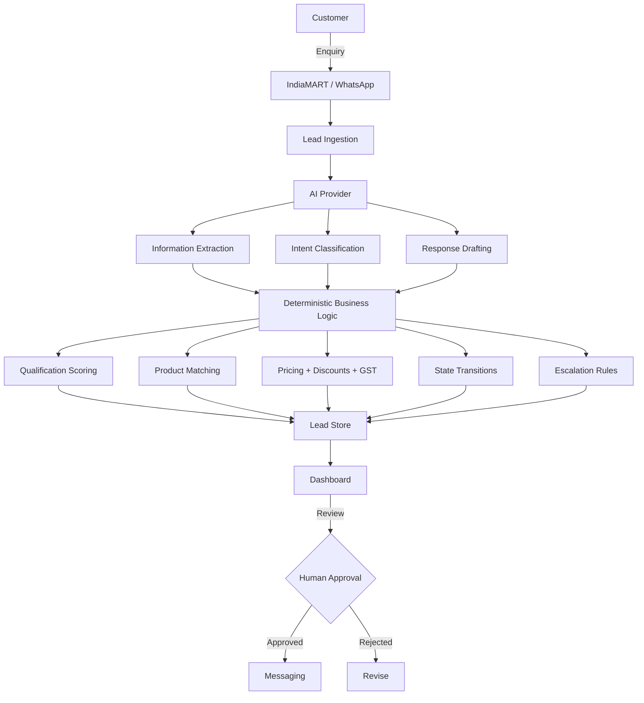

# AI Sales Agent for Indian B2B Manufacturing

> **[Live Demo](https://ai-sales-agent-ten.vercel.app)** · **[GitHub](https://github.com/realforged/ai-sales-agent)**
>
> Demo Mode — No API keys required

An AI-powered sales automation system for Indian B2B manufacturing. Handles the full lifecycle from enquiry ingestion through RFQ qualification, quotation generation, human approval, follow-ups and escalation — built with provider abstraction so mock integrations can be swapped for real ones without changing business logic.

Demonstrates AI-native product thinking, deterministic business logic separation, human-in-the-loop design, and end-to-end product development.

---

## Problem

Indian manufacturers receive dozens of enquiries daily through IndiaMART, WhatsApp and email. Each message is unstructured — mixed units, incomplete fields, broken English, Hinglish. Sales teams manually extract requirements, check catalogues, prepare quotations and track follow-ups.

This creates slow response times, inconsistent qualification, missed follow-ups and wasted sales capacity on repetitive work instead of closing deals.

## Solution

```
Customer Enquiry
  → Lead Ingestion (webhook)
  → AI Extraction (product, material, quantity, size, pressure class, application, location)
  → Intent Classification (interested, price objection, ready to buy, etc.)
  → RFQ Completeness Check
  → Qualification Scoring (deterministic, 0-100)
  → Product Matching + Quotation Draft
  → Human Approval Gate
  → Send to Customer
  → Follow-up Tracking
  → Escalation (price objection, custom requirement, at-risk deal)
```

AI handles language understanding. Deterministic code handles business decisions. Humans approve commercial commitments.

---

## Architecture



### Core principle

**AI handles ambiguity. Deterministic code handles business-critical decisions.**

The LLM is never trusted to directly determine:

| Never AI-controlled | Why |
|---|---|
| Pricing, discounts, GST/tax | Must be mathematically correct and auditable |
| Qualification scoring | Must be consistent and explainable |
| Lead state transitions | Must follow deterministic business rules |
| Escalation thresholds | Must be reliable (14 days no response = at-risk) |
| Final commercial commitments | Must have human approval |

---

## AI Architecture

The system depends on an `AIProvider` interface, not a specific model:

```
AIProvider
├── MockAIProvider        ← current demo (keyword-based, no API keys)
└── future provider       ← OpenAI / Claude with structured outputs
```

**AI is responsible for:**
- Extracting structured requirements from messy natural language
- Classifying customer intent from unstructured messages
- Drafting qualification responses and follow-up messages

**AI is not responsible for:**
- Any pricing, discount, tax or commercial decision
- Qualification scoring or lead state management
- Final message sending without human approval

The mock implementation proves the concept. A real LLM provider would implement the same interface — swapping it requires changing one file, not the business logic.

---

## Provider Abstraction

Three pluggable provider interfaces isolate integration-specific logic:

| Provider | Interface | Demo Implementation | Production Target |
|---|---|---|---|
| AI | `AIProvider` | `MockAIProvider` | OpenAI / Claude |
| Lead Source | `LeadSourceProvider` | `MockIndiaMARTProvider` | IndiaMART API |
| Messaging | `MessagingProvider` | `MockMessagingProvider` | WhatsApp Cloud API |

The core application never changes when a provider is replaced. Integration logic stays at the boundary.

---

## Human-in-the-Loop

```
AI extracts requirements
  → AI drafts quotation
  → Human reviews pricing, terms, discount
  → Human clicks Approve
  → System sends to customer
```

AI handles 90% of the work — extraction, matching, formatting. Humans control the final commercial commitment. The dashboard shows Approve / Edit / Reject buttons on every pending quotation.

---

## Key Engineering Decisions

1. **Provider abstraction** — All external integrations (AI, messaging, lead source) behind interfaces. Demo uses mocks, production swaps in real providers without touching business logic.

2. **AI/deterministic separation** — Language tasks go to AI. Pricing, scoring, state transitions and tax are pure deterministic functions. No LLM hallucination risk on critical decisions.

3. **Human approval gate** — Quotations cannot be sent without explicit human approval. Prevents autonomous commercial commitments.

4. **Zod validation** — External payloads (webhooks) validated at the API boundary with Zod schemas. Rejects malformed input before it reaches business logic.

5. **Reproducible demo scenarios** — 5 pre-built scenarios demonstrate complete lead lifecycles with one click. No external APIs, no network dependencies.

6. **Simulated time** — Follow-up and escalation timing demonstrated through manual time advancement, not real clocks. Makes the full pipeline demoable in 2 minutes.

7. **In-memory store** — GlobalThis singleton with localStorage persistence. Zero external dependencies for the demo. Ready to swap for PostgreSQL.

8. **Automated testing** — 29 tests covering extraction, qualification scoring, quotation calculation and end-to-end flows.

---

## Demo Scenarios

| # | Scenario | What it demonstrates |
|---|---|---|
| 1 | **Complete Enquiry** | Full IndiaMART enquiry → AI extraction → quotation generation |
| 2 | **Missing Technical Info** | Incomplete RFQ → AI asks clarifying questions → RFQ completion |
| 3 | **Price Objection** | Customer pushes back on price → AI responds → escalation to human |
| 4 | **No Response Follow-up** | Sent quotation → customer goes silent → automated follow-up tracking |
| 5 | **Custom Requirement Escalation** | Non-catalogue product → AI escalates to technical sales team |

---

## Tech Stack

| Layer | Technology |
|---|---|
| Frontend | Next.js 16 (App Router) |
| Language | TypeScript |
| Styling | Tailwind CSS v4 |
| Validation | Zod |
| Testing | Vitest |
| Storage | In-memory globalThis singleton + localStorage |
| AI | `AIProvider` + `MockAIProvider` |
| Lead Source | `LeadSourceProvider` + Mock IndiaMART |
| Messaging | `MessagingProvider` + Mock messaging |

---

## Testing

```
29/29 tests passing across 4 test files:
  ✓ extraction     — webhook processing, field extraction, RFQ creation
  ✓ qualification  — scoring engine, breakdown weights, edge cases
  ✓ quotation      — pricing, discounts, GST/tax, full calculation flow
  ✓ e2e            — complete sales cycle from webhook to escalation
```

```bash
npm test          # run all tests
npm run build     # production build
```

---

## Demo vs Production

| Demo | Production |
|---|---|
| Mock AI (keyword-based) | OpenAI / Claude with structured outputs |
| Mock IndiaMART | IndiaMART Buyer-Seller API + webhooks |
| Mock messaging | WhatsApp Cloud API |
| In-memory store + localStorage | PostgreSQL |
| Simulated time | Real scheduler + background jobs |
| Demo scenarios | Real customer events |
| No API keys | Secure secret management |
| Local / Vercel | Production infrastructure |

The demo is intentionally dependency-free. Real integrations are isolated behind provider interfaces and can be added without rewriting core business logic.

---

## Production Roadmap

1. Replace `MockAIProvider` with a real LLM using structured JSON outputs
2. Build evaluation dataset from real manufacturing enquiries
3. Measure extraction accuracy, intent classification F1, latency and cost
4. Integrate IndiaMART webhooks with HMAC signature verification
5. Integrate WhatsApp Cloud API for two-way messaging
6. Migrate from in-memory store to PostgreSQL with Prisma
7. Add background job queue (Redis + BullMQ) for AI processing and follow-up scheduling
8. Add authentication, RBAC and audit logging
9. Add production observability — metrics, tracing, alerting

---

## Getting Started

**Requirements:** Node.js 18+, npm

```bash
git clone https://github.com/realforged/ai-sales-agent.git
cd ai-sales-agent
npm install
npm run dev
```

Open [http://localhost:3000](http://localhost:3000)

No external API keys are required for demo mode.

---

## Project Structure

```
src/
├── app/
│   ├── api/
│   │   ├── demo/              # Demo controls (scenarios, time, reset)
│   │   ├── leads/             # Lead CRUD + response simulation
│   │   ├── quotation/         # Approve / send quotation
│   │   └── webhooks/          # IndiaMART webhook ingestion
│   └── leads/[id]/            # Lead detail page
├── components/
│   ├── dashboard/             # Dashboard with metrics, recommendations, demo controls
│   └── leads/                 # Lead detail with conversation, RFQ, quotation, escalation
├── data/
│   └── scenarios.ts           # 5 reproducible demo scenarios
├── lib/
│   ├── store.ts               # In-memory data store with localStorage persistence
│   ├── lead-service.ts        # Core business logic (webhook, extraction, qualification, quotation)
│   └── utils.ts               # Formatting, ID generation
├── services/
│   ├── business/
│   │   ├── qualification.ts   # Deterministic scoring engine (0-100, 7 dimensions)
│   │   └── quotation.ts       # Pricing, discounts, GST, product matching
│   └── providers/
│       ├── ai.ts              # AIProvider interface + MockAIProvider
│       ├── messaging.ts       # MessagingProvider interface + MockMessagingProvider
│       └── lead-source.ts     # LeadSourceProvider interface + MockIndiaMARTProvider
└── types/
    └── index.ts               # All enums and entity interfaces

tests/
├── extraction.test.ts         # Webhook processing, field extraction
├── qualification.test.ts      # Scoring engine
├── quotation.test.ts          # Pricing, discounts, tax
└── e2e.test.ts                # Full sales cycle
```

---

## Interview Talking Points

**"Why isn't AI responsible for pricing?"**
Pricing involves business rules — volume discounts, repeat customer rates, GST at 18%. An LLM might hallucinate a price or apply wrong math. AI handles the language; deterministic code handles the money.

**"Why use mock providers?"**
To make the demo reproducible without API credentials, network dependencies or model costs. Provider boundaries mean real integrations can be added later without touching business logic.

**"How would you integrate a real LLM?"**
Replace `MockAIProvider` with a production provider using structured JSON outputs, schema validation on extracted fields, retry logic, logging and evaluation datasets to measure accuracy over time.

**"How would you take this to production?"**
Real LLM + evaluations, IndiaMART/WhatsApp integrations, PostgreSQL, background jobs with retries and idempotency, authentication, monitoring and audit logs.

**"What is the most important architectural decision?"**
Separating probabilistic AI from deterministic business-critical logic. AI extracts and drafts. Deterministic code prices, scores and transitions states. Humans approve commercial commitments.

---

## About

Independent portfolio project exploring AI-native product development for Indian B2B manufacturing workflows. Built to demonstrate end-to-end product thinking — from problem identification through architecture, implementation, testing and deployment.

Built by [realforged](https://github.com/realforged).
